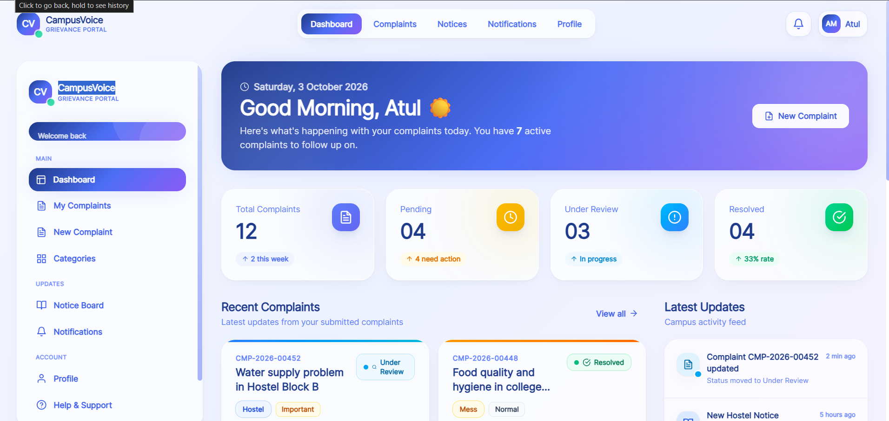
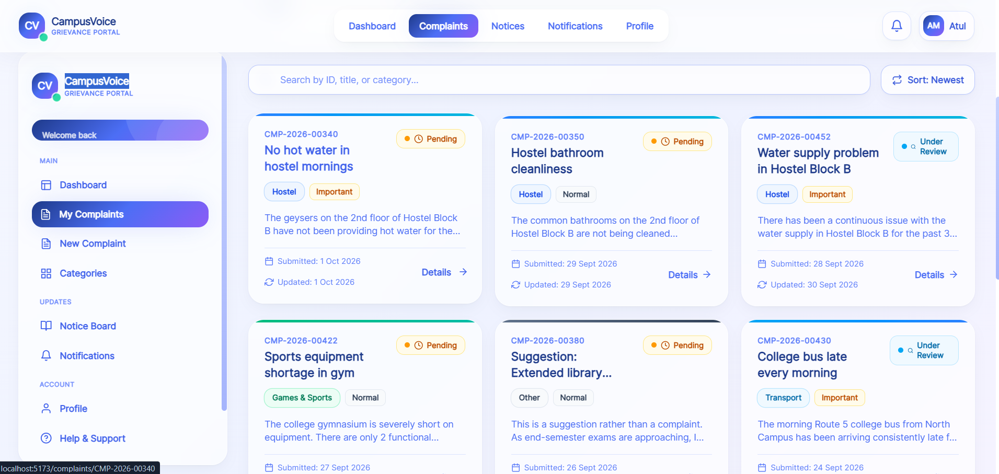
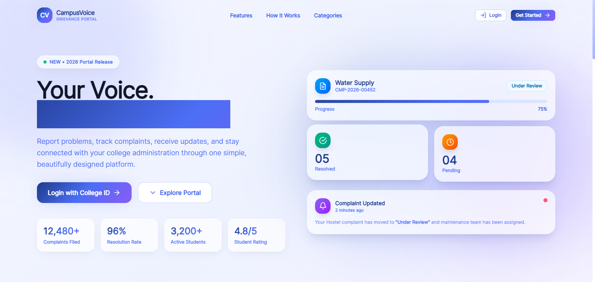
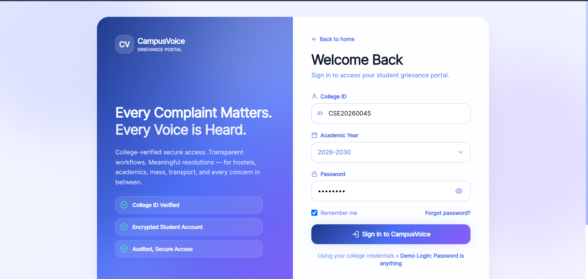

# 🎓 CampusVoice

### Student Grievance & College Complaint Management Portal

**CampusVoice** is a modern and responsive student grievance management platform designed to provide students with a simple way to submit, track, and manage college-related complaints.

Students can report issues related to **hostels, mess facilities, academics, college infrastructure, sports, transportation, student concerns, and other campus services** while keeping track of their complaint status and updates.

> **Your Voice. Our Responsibility.**

---

## ✨ Features

* 🎓 College ID based student login
* 📅 Academic year selection
* 📝 Submit multiple complaints
* 🏠 Hostel complaints
* 🍽️ Mess complaints
* 🏫 College & infrastructure complaints
* 📚 Academic complaints
* 🏃 Sports & games complaints
* 🚌 Transportation complaints
* 👥 Student/senior-related complaints
* 🔎 Search and filter complaints
* 📊 Complaint status tracking
* 🔔 Notification system
* 📢 Digital campus notice board
* 👤 Student profile
* 📋 Complaint history
* 📈 Complaint progress timeline
* 📱 Fully responsive design
* ✨ Smooth page and component animations
* 🌙 Modern dashboard interface

---

# 🖥️ Screenshots

## 🏠 Landing Page



---

## 📊 Dashboard



---

## 🏠 Dashboard — Alternative View



---

## 🔐 Student Login



---

# 🛠️ Tech Stack

| Technology       | Purpose             |
| ---------------- | ------------------- |
| React.js         | Frontend framework  |
| Tailwind CSS     | UI styling          |
| Framer Motion    | Animations          |
| React Router DOM | Page navigation     |
| React Icons      | Icons               |
| JavaScript       | Application logic   |
| LocalStorage     | Frontend demo state |

---

# 📂 Project Structure

```text
CampusVoice/
│
├── public/
│   └── images/
│       ├── home.png
│       ├── home2.png
│       ├── login.png
│       └── lading.png
│
├── src/
│   │
│   ├── components/
│   │   ├── Navbar.jsx
│   │   ├── Sidebar.jsx
│   │   ├── ComplaintCard.jsx
│   │   ├── CategoryCard.jsx
│   │   ├── NotificationBell.jsx
│   │   ├── NoticeCard.jsx
│   │   ├── Timeline.jsx
│   │   └── StatCard.jsx
│   │
│   ├── pages/
│   │   ├── Landing.jsx
│   │   ├── Login.jsx
│   │   ├── Dashboard.jsx
│   │   ├── Complaints.jsx
│   │   ├── NewComplaint.jsx
│   │   ├── ComplaintDetails.jsx
│   │   ├── Categories.jsx
│   │   ├── Notifications.jsx
│   │   ├── Notices.jsx
│   │   └── Profile.jsx
│   │
│   ├── data/
│   │   ├── complaints.js
│   │   ├── categories.js
│   │   ├── notices.js
│   │   └── notifications.js
│   │
│   ├── layouts/
│   │   └── DashboardLayout.jsx
│   │
│   ├── App.jsx
│   ├── main.jsx
│   └── index.css
│
├── .gitignore
├── package.json
├── package-lock.json
└── README.md
```

---

# 🚀 Getting Started

## 1. Clone the Repository

```bash
git clone https://github.com/your-username/CampusVoice.git
```

## 2. Go to the Project Folder

```bash
cd CampusVoice
```

## 3. Install Dependencies

```bash
npm install
```

## 4. Start Development Server

```bash
npm run dev
```

The application will be available at the local development URL shown in your terminal.

---

# 📦 Main Dependencies

Install the required packages using:

```bash
npm install react-router-dom framer-motion react-icons
```

If Tailwind CSS has not been configured yet, configure Tailwind according to your React/Vite setup.

---

# 🧭 Application Flow

```text
Landing Page
     │
     ▼
College ID Login
     │
     ▼
Student Dashboard
     │
     ├──────────────► Complaints
     │                    │
     │                    ▼
     │              Complaint Details
     │                    │
     │                    ▼
     │              Status Timeline
     │
     ├──────────────► Categories
     │                    │
     │                    ▼
     │              File Complaint
     │
     ├──────────────► Notifications
     │
     ├──────────────► Notice Board
     │
     └──────────────► Student Profile
```

---

# 📋 Complaint Categories

CampusVoice supports multiple complaint categories:

### 🏠 Hostel

* Room maintenance
* Water supply
* Electricity
* Cleanliness
* Security
* Room allocation

### 🍽️ Mess

* Food quality
* Hygiene
* Menu
* Food timing
* Pricing
* Staff concerns

### 🏫 College

* Classroom
* Library
* Laboratory
* Infrastructure
* Internet
* Electricity

### 📚 Academic

* Faculty concerns
* Examination
* Timetable
* Assignments
* Academic facilities

### 🏃 Games & Sports

* Sports equipment
* Ground maintenance
* Tournament issues
* Coaching
* Sports facilities

### 🚌 Transport

* Bus timing
* Routes
* Driver concerns
* Transportation facilities

### 👥 Student / Senior Concerns

* Student behavior
* Harassment concerns
* Ragging-related concerns
* Other student-related issues

### 📌 Other

For complaints that don't belong to another category.

---

# 📊 Complaint Status

Each complaint can have a different status:

```text
🟡 Pending
🔵 Under Review
🟣 Escalated
🟢 Resolved
🔴 Rejected
```

Students can view the progress of their complaint through a visual timeline.

---

# 🎨 UI & Animation

CampusVoice focuses on a modern user experience with:

* Glassmorphism
* Gradient backgrounds
* Animated cards
* Smooth page transitions
* Hover animations
* Interactive buttons
* Animated complaint timelines
* Notification animations
* Mobile navigation animations
* Dashboard entrance animations

Animations are implemented using **Framer Motion**.

---

# 📱 Responsive Design

CampusVoice is designed to work across:

* 💻 Desktop
* 💻 Laptop
* 📱 Mobile
* 📟 Tablet

The desktop layout is optimized for common laptop resolutions such as:

```text
1366 × 768
1440 × 900
1920 × 1080
```

---

# 🔐 Authentication

This version is a **frontend-only demonstration**.

The login interface demonstrates:

* College ID
* Academic year
* Password
* Remember me
* Password visibility
* Login interaction

No real authentication server or database is currently connected.

---

# 🗄️ Backend

The current version does **not** contain a backend.

All complaint, notification, and notice information is represented using frontend mock data.

Future versions can integrate:

```text
React
      ↓
Node.js + Express
      ↓
MongoDB
```

Possible future features include:

* Real student authentication
* Admin dashboard
* Complaint assignment
* Department management
* Real-time notifications
* Email notifications
* Complaint escalation
* File uploads
* Database storage
* Admin response system

---

# 🔮 Future Improvements

* 👨‍💼 Admin dashboard
* 🏫 Department-wise complaint management
* 👨‍🏫 Faculty/admin login
* 🔐 JWT authentication
* 🗃️ MongoDB database
* 📧 Email notifications
* 📱 Push notifications
* 📎 Real file/document uploads
* 💬 Student-admin communication
* 📈 Complaint analytics
* 📊 Admin reports
* ⚡ Real-time complaint updates

---

# 🎯 Project Goal

The goal of CampusVoice is to create a centralized digital platform where students can easily communicate their concerns to college administration and track the progress of their complaints.

Instead of relying on physical complaint boxes or scattered communication channels, CampusVoice provides a structured digital experience for:

**Report → Track → Update → Resolve**

---

# 👨‍💻 Developer

### Atul Munesh

Frontend Developer | React.js | MERN Stack

---

# ⭐ Support

If you find this project useful, consider giving the repository a ⭐ on GitHub.

---

## 📄 License

This project is created for educational and portfolio purposes.
